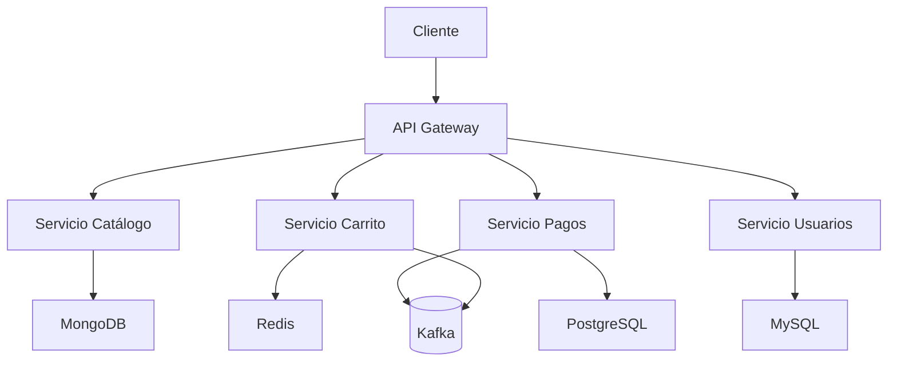
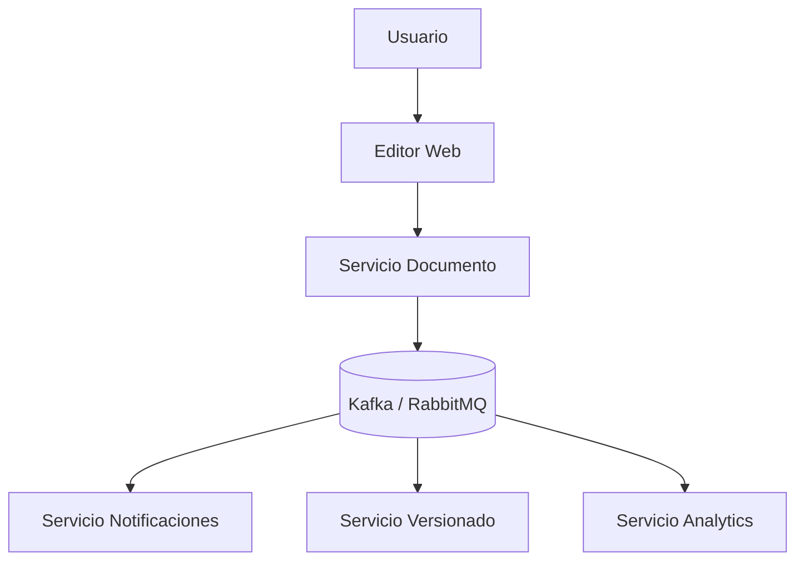
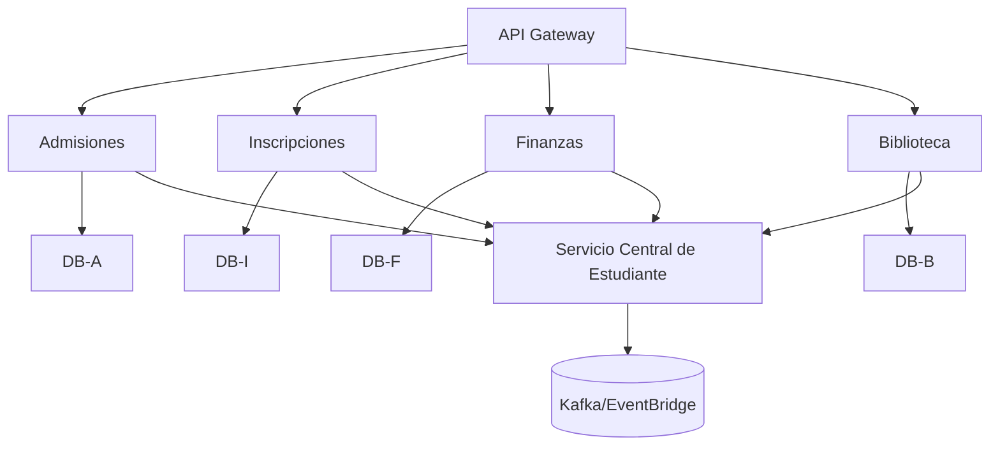

# Guía Práctica de Arquitectura de Software 

Este repositorio contiene la entrega completa del trabajo práctico de arquitectura de software, incluyendo todos los ejercicios resueltos con diagramas renderizables usando Mermaid.

Autor: **MARIANA HUMPIRI Y DAISI FLORES]**
Fecha: **10-06-25**

---

## Ejercicio 1: El Proyecto Personal

### Arquitectura Propuesta

**Monolito en Capas**, con despliegue moderno, CI/CD y seguridad básica.

### Diagrama Mermaid

```mermaid
graph TD
  Usuario --> Frontend[Frontend (HTML/CSS/JS) - GitHub Pages/Netlify]
  Frontend --> Backend[Backend (Node.js + Express - Render/Vercel)]
  Backend --> DB[Base de Datos (MongoDB Atlas o Firebase)]
  GitHub --> CI[GitHub Actions - CI/CD]
  CI --> Frontend
  CI --> Backend
```

---

## Ejercicio 2: La Startup en Crecimiento

### Arquitectura Propuesta

**Microservicios + API Gateway**, con servicios independientes y bases de datos por dominio.

### Diagrama Mermaid



---

## Ejercicio 3: Aplicación Social en Tiempo Real

### Arquitectura Propuesta

**Arquitectura Orientada a Eventos (EDA)** con servicios desacoplados y flujo asincrónico.

### Diagrama Mermaid



---

## Ejercicio 4: Sistema Corporativo Universitario

### Arquitectura Propuesta

**Microservicios organizados por Dominio (DDD)** con integración de sistemas heredados y sincronización de datos.

### Diagrama Mermaid



---

## Conclusión

Este README resume todas las decisiones arquitectónicas tomadas, fundamentadas por los drivers clave de cada escenario:

* **Ejercicio 1:** Simplicidad, bajo costo, facilidad de mantenimiento.
* **Ejercicio 2:** Escalabilidad, resiliencia, evolutividad.
* **Ejercicio 3:** Baja latencia, desacoplamiento, procesamiento en tiempo real.
* **Ejercicio 4:** Modularidad, alineación con el negocio, integración con sistemas legados.

Todos los diagramas están integrados con Mermaid para ser visualizados directamente en GitHub.


